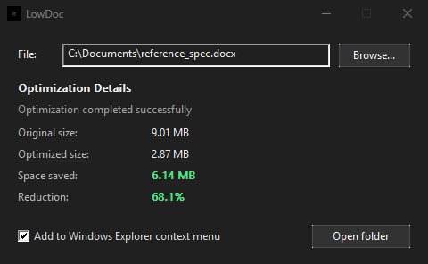
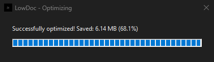

# LowDoc

Lossless document and image optimizer written in native C++20.

LowDoc strips hidden bloat, duplicate assets, redundant metadata, and recompresses internal streams across modern documents without losing a single pixel, vector, or formatting detail.

## Features

### Custom Deflate Engine
Built-in RFC 1951 LZ77 and Huffman compressor. Evaluates multiple compression strategies in memory and selects the smallest valid bitstream.

### Multi-Format Support
Cleans and optimizes 17 file formats out of the box:
- **Office**: DOCX, XLSX, PPTX, DOTX, XLTX, POTX, XLAM, DOCM, PPTM
- **OpenDocument**: ODT, ODS, ODP
- **Documents & Books**: PDF, EPUB, RTF
- **Images**: PNG, JPEG, SVG

### Asset Deduplication & Cleanup
- Detects identical embedded images, fonts, and media via SHA-256 and merges them into shared references.
- Strips editing history (RSID tags), unused styles, orphaned relationships, and redundant namespaces.
- Minifies internal XML markup while safely preserving whitespace in formatted text.

### Digital Signature Guard
Detects cryptographic signatures and `/ByteRange` blocks in PDFs and signed archives, leaving them untouched to avoid breaking document seals.

## Highlights

- **100% Lossless**: Identical visual output, exact fonts, full Unicode text, and pixel-perfect images.
- **Native Win32 GUI**: Clean desktop interface in pure Win32. No Electron, no WebViews, no heavy runtimes.
- **Explorer Context Menu**: Right-click any file to compress it with a quick progress HUD.
- **Dark Mode Support**: Follows Windows system theme with native Segoe UI typography and DWM title bar styling.
- **Zero Bloat & Offline**: Standalone binaries with no external DLLs, no background services, and zero telemetry.
- **Non-Destructive**: Keeps your original file safe, saving output as `filename.lowdoc.<ext>`.

## Screenshots

<p align="center">
  
  <br>
  <em>Native Win32 GUI with optimization metrics</em>
</p>

<p align="center">
  
  <br>
  <em>Explorer context-menu progress HUD</em>
</p>

## Architecture

- **`lowdoc_core`**: Static engine library (Deflate, ZIP parser/serializer, XML parsers, format detectors, asset deduplicator).
- **`lowdoc.exe`**: Multi-threaded CLI tool for batch processing and scripts.
- **`lowdoc_gui.exe`**: Win32 GUI with drag-and-drop, real-time stats, and Explorer context menu integration.

## How It Works

1. **Format Check**: Identifies the format by file magic bytes, not just the file extension.
2. **Unpacking**: Reads internal archives and object trees directly in memory.
3. **Cleaning Passes**:
   - Removes RSID edit markers, thumbnails, and revision clutter.
   - Cleans unused styles and redundant XML namespaces.
   - Merges identical images and shared media.
   - Normalizes and minifies XML markup.
4. **Stream Compression**: Recompresses data streams using optimal Deflate passes.
5. **Validation**: Verifies package integrity before saving. If no bytes are saved, the original file is left as-is.

## Benchmark

Results on a reference document (`reference_spec.docx`) containing full character sets (Latin, Cyrillic, Greek, Math), structured tables, custom styles, and repeated high-resolution media:

| Metric | Original | Optimized | Change |
|---|---|---|---|
| **File Size** | 9.01 MB | 2.87 MB | **-6.14 MB (-68.1%)** |
| **Duplicate Media** | 12 images | 4 shared images | -6.04 MB payload |
| **Styles & RSIDs** | 7 styles, 18 RSIDs | 3 active styles, 0 RSIDs | -1.2 KB |
| **XML Markup** | Indented & verbose | Minified & consolidated | -14.8 KB |
| **Integrity** | Baseline | Identical | Lossless |

## Download & Usage

Get the latest build from [Releases](https://github.com/SashkoTadof/LowDoc/releases).

### GUI
Run `lowdoc_gui.exe` and drop your files into the window, or right-click files in Windows Explorer.

### CLI
```powershell
# Optimize a single file
lowdoc document.docx

# Save to a specific path
lowdoc document.docx -o output.docx

# Optimize a folder recursively
lowdoc ./documents --recursive

# Output JSON summary
lowdoc document.docx --json

# Quiet mode
lowdoc document.docx --quiet
```

## Requirements

- **OS**: Windows 10 / 11 64-bit (or Linux for CLI).
- **Permissions**: Standard user account (writes to user registry only when enabling the context menu).

## Build

Requires Visual Studio 2022 (C++20), Windows SDK 10.0.22621+, and CMake 3.20+.

```powershell
cmake -B build -S .
cmake --build build --config Release
```

Binaries will be in `build/Release/`:
- `lowdoc.exe`
- `lowdoc_gui.exe`
- `lowdoc_test.exe`

### Running Tests
```powershell
.\build\Release\lowdoc_test.exe
```

## License

[MIT](LICENSE)
